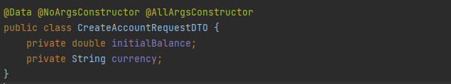
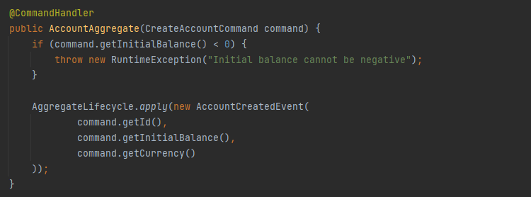
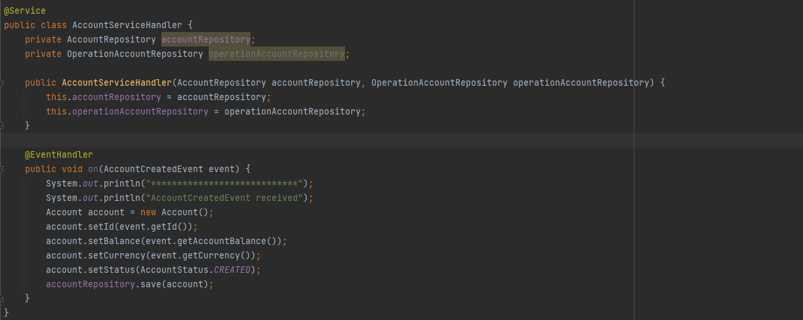
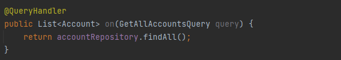
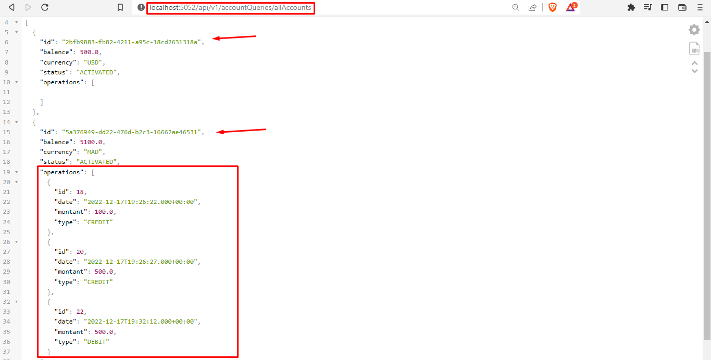

<h2 align="center"><💻 Event Driven Architecture CQRS and Event Sourcing 💻/></h2>
<h5>- Architecture</h5>

<h5>- Dependencies</h5>
<table>
    <tr>
        <td><a href="https://mvnrepository.com/artifact/org.springframework.boot/spring-boot-starter-web">Spring Web</a></td>
        <td><a href="https://mvnrepository.com/artifact/org.springframework.boot/spring-boot-starter-data-jpa">Spring Data JPA</a></td>
        <td><a href="https://mvnrepository.com/artifact/org.springframework.boot/spring-boot-starter-data-rest">Spring Data REST</a></td>
        <td><a href="https://mvnrepository.com/artifact/mysql/mysql-connector-java">MySQL Driver</a></td>
        <td><a href="https://mvnrepository.com/artifact/org.projectlombok/lombok">Lombok</a></td>
    </tr>
    <tr>
        <td><a href="https://mvnrepository.com/artifact/org.mapstruct/mapstruct">MapStruct</a></td>
        <td><a href="https://mvnrepository.com/artifact/org.axonframework/axon-spring-boot-starter">Axon Spring Boot Starter</a></td>
   </tr>
</table>

    
📝 Partie 1 - Ecriture <a href="" target="_blank">[Code Source]</a>

    

        <h4>Creation des commandes (CommonApi)</h4>
        <h5>- BaseCommand</h5>
        
        <h5>- CreateAccountCommand</h5>
        
        <h5>- CreditAccountCommand</h5>
        
        <h5>- DebitAccountCommand</h5>
        
        <h5>- Controller CreateAccountCommand (Commands)</h5>
        
        
        
        <h5>- Base de données (PhpMyAdmin)</h5>
        
        <h4>Creation des événements (CommonApi)</h4>
        <h5>- BaseEvent</h5>
        
        <h5>- AccountCreatedEvent</h5>
        
        <h5>- Creation de l'agrégat (AccountAggregate)</h5>
        
        <h5>- CommandHandler</h5>
        
        <h5>- EventSourcingHandler</h5>
        
        <h5>- Test (Postman)</h5>
        
        <h5>- EventStore</h5>
            
        <h5>- EventStore (Controller)</h5>
        
        
        <h5>- AccountActivatedEvent & EventSourcingHandler</h5>
        
        
        <h5>- Test (Postman)</h5>
        
        
        <h5>- AccountDebitedEvent</h5>
        
        <h5>- EventSourcingHandler</h5>
        
        <h5>- CreditAccount (Controller)</h5>
        
        <h5>- Test (Postman)</h5>
        
        
        
        <h5>- AccountDebitedEvent</h5>
        
        <h5>- CommandHandler & EventSourcingHandler</h5>
        
        <h5>- DebitAccount (Controller)</h5>
        
        <h5>- Test (Postman)</h5>
        
        
        
    

    
📝 Partie 2 - Lecture <a href="">[Code Source]</a>

    

        <h5>- Entity Account</h5>
        
        <h5>- Entity OperationAccount</h5>
        
        <h5>- Repository AccountRepository</h5>
        
        <h5>- Repository OperationAccountRepository</h5>
        
        <h5>- AccountServiceHandler (AccountCreatedEvent)</h5>
        
        
        
        <h5>- AccountServiceHandler (AccountActivatedEvent, AccountDebitedEvent, AccountCreditedEvent)</h5>
        
        
        
        
        
        <h5>- Controlleur pour la lecture(AllAccounts)</h5>
        
        
        
        <h5>- Controlleur pour la lecture(getAccountById)</h5>
        
        
        
    

    

